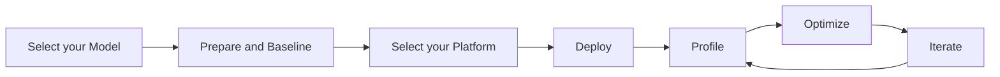

# Edge AI Benchmarking Guide

This guide provides a practical, step-by-step workflow and essential resources for effectively benchmarking and profiling your Edge AI system. Quickly identify bottlenecks, address scalability challenges, uncover optimization opportunities to enhance efficiency and accelerate performance.

## Table of Contents

- [Benchmarking Workflow](#benchmarking-workflow)
   - [Step 0: Select your Model](#step-0-select-your-model)
   - [Step 1: Prepare and Baseline the Model](#step-1-prepare-and-baseline-the-model)
   - [Step 2: Select your Target Platform](#step-2-select-your-target-platform)
   - [Step 3: Deploy](#step-3-deploy)
   - [Step 4: Profile and Identify Bottlenecks](#step-4-profile-and-identify-bottlenecks)
   - [Step 5: Optimize](#step-5-optimize)
   - [Step 6: Iterate](#step-6-iterate)
- [Resources](#resources)

## Benchmarking Workflow


> [!IMPORTANT]  
> If you already have your application requirements in hand, make sure to follow along each phase of the workflow.

> [!NOTE]
> If the model is already running on your target edge device jump straight to the [step 4](#step-4-profile-and-identify-bottlenecks).

## Step 0: Select your Model
> [!WARNING]
> At this stage, it's strongly recommended that your model be pre-optimized[^1] and ready to run on an Edge AI device.

Select your baseline model. If you don't have one, you can pick a pre-optimized model from [Edge AI Model Zoos](https://github.com/afondiel/Edge-AI-Model-Zoo) to get started.

## Step 1: Prepare and Baseline the Model

Before committing to a specific edge platform and diving into complex optimizations, it's crucial to prepare your model and establish a baseline performance. 

This vital preliminary step helps you gain a fundamental understanding of your model's characteristics and suitability, ultimately saving significant time and effort in later stages.

Evaluate your model’s baseline performance based on your application target performance metrics.

Some examples of key metrics: 
- **Accuracy** (Top-1%): Target/Expected (Acceptable) accuracy based on the application requirements
- **Latency (ms)**: Time per inference (Crucial for real-time applications).
- **Throughput (inf/s)**: Inferences per second (High-performance application with AI Accelerators, like GPUs, TPUs, ...).
- **Memory Footprint (MB)**: RAM and storage footprint.
- **Compute**: Number of OPS, Hardware workload (runtime)
- **Energy (mWh)**: Power consumption (for battery-based device like wearables, smartphones ...).

Bench Table Template

| **Model**       | **Task**               | **Accuracy** | **Latency (ms)** | **Model Size (MB)** |**Params Size (MB)** | **Compute Cost (GFLOPS)**         | **[Platform](#step-2-choose-your-target-edge-platform)**                         |
|------------------|------------------------|--------------|------------------|---------------------|---------------------|----------------------|---------------------------------------|
| MobileNet V2     | Image Classification  | 72.0%        | 25               | 4.3                 |3.5                 | XX    | Android, iOS, Web  |

You can use the Python script below as template to find these metrics.

```python
# Benchmark latency with LiteRT (formerly TensorFlow Lite)
import tensorflow as tf
import time

interpreter = tf.lite.Interpreter(model_path="model.tflite")
interpreter.allocate_tensors()
input_details = interpreter.get_input_details()
output_details = interpreter.get_output_details()

start_time = time.time()
interpreter.invoke()
latency = (time.time() - start_time) * 1000  # ms
print(f"Latency: {latency:.2f} ms")
```
- Benchmark `throughput` and `Accuracy` using [tensorflow](https://www.tensorflow.org/):
```python
# Predict and benchmark throughput using tensorflow
def predict_and_benchmark_throughput(batched_input, infer, N_warmup_run=50, N_run=1000):

  elapsed_time = []
  all_preds = []
  batch_size = batched_input.shape[0]

  for i in range(N_warmup_run):
    labeling = infer(batched_input)
    preds = labeling['output_0'].numpy()

  for i in range(N_run):
    start_time = time.time()
    labeling = infer(batched_input)
    preds = labeling['output_0'].numpy()
    end_time = time.time()
    elapsed_time = np.append(elapsed_time, end_time - start_time)
    all_preds.append(preds)

    if i % 50 == 0:
      print('Steps {}-{} average: {:4.1f}ms'.format(i, i+50, (elapsed_time[-50:].mean()) * 1000))

  print('Throughput: {:.0f} images/s'.format(N_run * batch_size / elapsed_time.sum()))
  return all_preds
```
- `Accuracy`:

```python
# Observe accuracy using tensorflow
def show_predictions(model):

  img_path = './data/img0.JPG'  # golden_retriever
  img = image.load_img(img_path, target_size=(299, 299))
  x = image.img_to_array(img)
  x = np.expand_dims(x, axis=0)
  x = preprocess_input(x)
  x = tf.constant(x)

  labeling = model(x)
  preds = labeling['predictions'].numpy()

  # decode the results into a list of tuples (class, description, probability)
  # (one such list for each sample in the batch)
  print('{} - Predicted: {}'.format(img_path, decode_predictions(preds, top=3)[0]))
  plt.subplot(2,2,1)
  plt.imshow(img)
  plt.axis('off')
  plt.title(decode_predictions(preds, top=3)[0][0][1])
```

## Step 2: Select your Target Platform

Selecting the right edge platform/device is crucial for the overall performance and efficiency of your application (computational demands, environmental conditions, operational constraints, etc.). Please refer to this [resource](https://github.com/afondiel/Edge-AI-Platforms) for more in depth.


| **Target Device**                          | **CPU (%)**      | **AI Accelerator (GPU/NPU)[^1]**| **Compute (OPS)**  | **Speed (TOPS/s)[^2]**        | **Memory Footprint (RAM/VRAM)**|**Storage usage (SD card/Onboard Flash)**     |**Power (W)**    |**Energy (Wh/J)** |**Efficiency (GOPS/W)[^3]**  |**Temperature (°C)** |
|:-------------------------------------------|:------------------:|:----------------------------:|:-----------------------:|:----------------------------:|:--------------------------:|:----------------------------------------:|:-----------------:|:-----------------:|:------------------:|:---------------------:|
| **System on Chips (SoCs)**                 | -                    |  -                         | GFlops                | MHz/GHz                    | MB                       |-                                       |-             |-            |-            |°C                   |               
| **Microcontrollers (MCUs)**                | -                    |  -                         | GFlops                | MHz                        | KB                       |-                                       |-             |-            |-            |°C                   | 
| **Field-Programmable Gate Arrays (FPGAs)** | -                    |  -                         | GFlops                | MHz                        | MB                       |-                                       |-             |-            |-            |°C                   |               
| **Edge AI Boxes and Gateways**             | -                    |  -                         | GFlops                | MHz/GHz                    | MB/GB                    |-                                       |-             |-            |-            |°C                   |
| **Mobile and Embedded Devices**            | -                    |  -                         | GFlops                | GHz                        | MB/GB                    |-                                       |-             |-            |-            |°C                   |
| **Specialized Edge Devices**               | -                    |  -                         | GFlops                | GHz                        | MB/GB                    |-                                       |-             |-            |-            |°C                   | 
| **Industrial and Custom Edge Devices**     | -                    |  -                         | GFlops                | GHz                        | MB/GB                    |-                                       |-             |-            |-            |°C                   |
| **Robotics-Focused Edge Devices**          | -                    |  -                         | GFlops                | GHz                        | MB/GB                    |-                                       |-             |-            |-            |°C                   |


### **Rule of Thumb**
- **Small Devices (e.g., IoT sensors)**: Use the smallest model with acceptable accuracy.
- **Mid-Power Devices (e.g., drones, edge servers)**: Prefer low-resolution models with moderate complexity.
- **High-Critical Applications (e.g., autonomous vehicles)**: Prioritize models balancing accuracy and latency.

## Step 3: Deploy

Convert and compile your model for your target hardware platform's runtime. 

For instance, if you have a PyTorch model and are working on a [Raspberry Pi](https://github.com/diesimo-ai/diesimo-lab/blob/main/README.md#hardware-platforms) you might choose [onnxruntime](https://github.com/microsoft/onnxruntime) as inference engine. This would involve converting/exporting your model to ONNX format (e.g., `your_model.onnx`).

The same principles apply to other engines like [LiteRT](https://ai.google.dev/edge/litert) or [TensorRT](https://github.com/NVIDIA/TensorRT).

For further reading, please refer to the End-to-end Edge AI deployment stack resource[^4].

## Step 4: Profile and Identify Bottlenecks


- Credit: ([Link](https://www.youtube.com/watch?v=8Rr_8jy1_GY))

To identify performance bottlenecks, resource consumption (computation workload, memory footprint, energy consumption), and optimization opportunities, analyze the model’s runtime behavior.

Leverage profiling tools integrated within your training/inference framework (e.g., PyTorch, ONNX Runtime, LiteRT, NVIDIA TensorRT), such as:
- **[TensorFlow Lite Benchmark Tool](https://www.tensorflow.org/lite/performance/measurement)**: Measures latency and memory on mobile devices.
- **[ONNX Runtime Profiler](https://onnxruntime.ai/)**: Profiles layer-wise performance.
- **[NVIDIA Jetson Performance Tool (JTOP)](https://github.com/rbonghi/jetson_stats)**: Monitor and benchmark AI workloads on NVIDIA Jetson devices.
- **[PyTorch Benchmark Utilities](https://docs.pytorch.org/tutorials/recipes/recipes/benchmark.html)**: Benchmark PyTorch models for speed and memory usage.
  - [TorchProfiler](https://docs.pytorch.org/tutorials/recipes/recipes/profiler_recipe.html), [TorchBench](https://github.com/pytorch/benchmark)
-  **[Edge Impulse](https://www.edgeimpulse.com/)**: End-to-end benchmarking and deployment on edge devices.
- **[Qualcomm Profiler](https://www.qualcomm.com/developer/software/qualcomm-profiler)**: a system-wide tool designed to visualize system performance and identify optimization. 
- **[Geekbench](https://www.geekbench.com/)**: a cross-platform benchmark that measures your system's performance
- **[ARM Compute Library](https://developer.arm.com/tools-and-software/compute-library)**:Benchmark AI models on ARM processors (e.g., Cortex-M, Cortex-A).  
- **[AWS SageMaker Edge Manager](https://aws.amazon.com/sagemaker/edge/)**: Benchmark, manage, and optimize AI models on edge devices connected to AWS.
- **[Google ML Kit](https://developers.google.com/ml-kit)**: Benchmark pre-trained models and custom solutions on Android/iOS devices.
- **[MLPerf Tiny](https://github.com/mlcommons/tiny)**: an ML benchmark suite for extremely low-power systems such as microcontrollers
- **[MLPerf Edge](https://github.com/mlcommons/inference)**: a benchmark suite for measuring how fast systems can run models in a variety of deployment scenarios from Edge to Cloud


### **Profiling Metrics Examples**

<table border="1">
  <thead>
    <tr>
      <th>Model</th>
      <th>Bit-Width (W/A) </th>
      <th>Size (MB)</th>
      <th>Params</th>
      <th>Depth</th>
      <th>Top-1 Accuracy</th>
      <th>Top-5 Accuracy</th>
      <th>Latency (ms) (CPU)</th>
      <th>Latency (ms) (GPU) </th>
      <th>Energy (W)</th>
      <th colspan="3">Compute (OPS/GFlops)</th>
      <th><a href="#step-2-choose-your-target-edge-platform">Platform</a></th>
    </tr>
    <tr>
      <th></th>
      <th></th>
      <th></th>
      <th></th>
      <th></th>
      <th></th>
      <th></th>
      <th></th>
      <th></th>
      <th></th>
      <th>CPU</th>
      <th>GPU</th>
      <th>NPU</th>
      <th>--</th>
    </tr>
  </thead>
  <tbody>
    <tr>
      <td>Xception</td>
      <td>FP32</td>
      <td>88</td>
      <td>22.9M</td>
      <td>81</td>
      <td>79.0%</td>
      <td>94.5%</td>
      <td>109.4</td>
      <td>8.1</td>
      <td>-</td>
      <td>-</td>
      <td>-</td>
      <td>-</td>
      <td>-</td>
    </tr>
    <tr>
      <td>VGG16</td>
      <td>FP32</td>
      <td>528</td>
      <td>138.4M</td>
      <td>16</td>
      <td>71.3%</td>
      <td>90.1%</td>
      <td>69.5</td>
      <td>4.2</td>
      <td>-</td>
      <td>-</td>
      <td>-</td>
      <td>-</td>
      <td>-</td>
    </tr>
    <tr>
      <td>VGG19</td>
      <td>FP32</td>
      <td>549</td>
      <td>143.7M</td>
      <td>19</td>
      <td>71.3%</td>
      <td>90.0%</td>
      <td>84.8</td>
      <td>4.4</td>    
      <td>-</td>
      <td>-</td>
      <td>-</td>
      <td>-</td>
      <td>-</td>
    </tr>
    <tr>
      <td>ResNet50</td>
      <td>FP32</td>
      <td>98</td>
      <td>25.6M</td>
      <td>107</td>
      <td>74.9%</td>
      <td>92.1%</td>
      <td>58.2</td>
      <td>4.6</td>    
      <td>-</td>
      <td>-</td>
      <td>-</td>
      <td>-</td>
      <td>-</td>
    </tr>
  </tbody>
</table>

**Test environments**
```
The top-1 and top-5 accuracy refers to the model's performance on the ImageNet validation dataset.

Depth refers to the topological depth of the network. This includes activation layers, batch normalization layers etc.

Time per inference step is the average of 30 batches and 10 repetitions.

- CPU: AMD EPYC Processor (with IBPB) (92 core)
- RAM: 1.7T
- GPU: Tesla A100
- Batch size: 32
Depth counts the number of layers with parameters.
```
(Source: [Keras Applications](https://keras.io/api/applications/))

### Tracing


- Credit: ([Link](https://www.youtube.com/watch?v=8Rr_8jy1_GY))

Use tracing tool to [analyze](https://docs.pytorch.org/tutorials/intermediate/tensorboard_profiler_tutorial.html) your profiling results:

- [Perfetto](https://perfetto.dev/docs/)
- [chrome://tracing/](chrome://tracing/)
- [TensorBoard (Standalone)](https://www.tensorflow.org/tensorboard)


## Step 5: Optimize


Wang et al. "Optimizing Edge AI: A Comprehensive Survey on Data, Model, and System Strategies", arXiv pp, [arXiv:2501.03265v1](https://arxiv.org/abs/2501.03265), 2025

After identifying performance bottlenecks, you can apply Edge AI SOTA optimization techniques across the data pipeline, model, and system architecture (as shown in diagram above) to meet your application goals.

For example, if you decide to use quantization, reducing the model precision from `FP32` to `INT8` can reduce the memory footprint and speed up computation, potentially resulting in the following table.

<table border="1">
  <thead>
    <tr>
      <th>Model</th>
      <th>Bit-Width (W/A) </th>
      <th>Size (MB)</th>
      <th>Params (MB)</th>
      <th>Top-1% Accuracy</th>
      <th>Storage (MB)</th>
      <th>Latency (ms) </th>
      <th>Throughput (inf/s) </th>
      <th>Energy (W)</th>
      <th colspan="3">Compute (OPS/GFlops)</th>
      <th><a href="#step-2-choose-your-target-edge-platform">Platform</a></th>
    </tr>
    <tr>
      <th></th>
      <th></th>
      <th></th>
      <th></th>
      <th></th>
      <th></th>
      <th></th>
      <th></th>
      <th></th>
      <th>CPU</th>
      <th>GPU</th>
      <th>NPU</th>
      <th>--</th>
    </tr>
  </thead>
  <tbody>
    <tr><td rowspan="3">ResNet-50</td></tr>
    <tr>
      <td>FP32 (Full Precision)</td>
      <td>-</td>
      <td>-</td>
      <td>-</td>
      <td>-</td>
      <td>-</td>
      <td>-</td>
      <td>-</td>
      <td>-</td>
      <td>-</td>
      <td>-</td>
      <td rowspan="3">MCU, Pi, Jetson Nano</td>
    </tr>
    <tr>
      <td>INT8 (Quantized)</td>
      <td>-</td>
      <td>-</td>
      <td>-</td>
      <td>-</td>
      <td>-</td>
      <td>-</td>
      <td>-</td>
      <td>-</td>
      <td>-</td>
      <td>-</td>
    </tr>
  </tbody>
</table>

## Step 6: Iterate
- Test on real hardware, not just simulators.
- Use representative datasets for accurate benchmarking.
- Iterate: Optimize incrementally and re-benchmark.

## Resources

### **Pro Tips**

I. Model Evaluation:
- **Target Metrics First**: Define critical metrics like latency, memory footprint, or accuracy based on the application.  
- **Test Across Devices**: Models may perform differently on diverse edge hardware—ensure compatibility.  
- **Use Representative Data**: Benchmark using datasets that match real-world scenarios to achieve accurate evaluations.  
- **Automate the Process**: Set up automated pipelines for benchmarking multiple models to save time.  
- **Iterate and Optimize**: Use optimization techniques (e.g., pruning, quantization) to balance accuracy and efficiency.

II. Common Pitfalls to Avoid:
- **Overlooking Real-World Constraints**: Failing to account for intermittent power, connectivity, or thermal limitations can derail deployment.  
- **Underestimating Deployment Complexity**: Ensure the model integrates seamlessly with existing frameworks and workflows.  
- **Ignoring Edge-Specific Tools**: Generic tools might not capture nuances of edge environments. Leverage specialized tools for accurate profiling.  

III. **Practical Steps for Optimization**
1. **Benchmark Models**: Evaluate latency, memory usage, and energy efficiency on target edge hardware.
2. **Choose Lightweight Architectures**: Use models like MobileNet, EfficientNet-Lite, or low-resolution versions of larger models.
3. **Quantize Models**: Convert models to INT8 or lower precision to reduce size and computation.
4. **Simulate Edge Scenarios**: Test models under realistic conditions (e.g., low power, intermittent connectivity).
5. **Optimize Pipelines**: Employ pruning, knowledge distillation, or layer fusion to enhance performance.

---

- [^1]: [Edge AI Optimization Stack](https://github.com/afondiel/computer-science-notebook/tree/master/core/systems/edge-computing/edge-ai/concepts/optimization)
- [^1]: Onboard AI accelerator for high-performance workloads/Applications
- [^2]: Measures the peak computational capacity (throughput) of an AI processor or SoC i.e., TOPS=2 x MACs x frequency/10^12
- [^3]: Measures the computational operations (achieved during workload) per watt of power consumed
- [^4]: [Edge AI Deployment Stack](https://github.com/afondiel/computer-science-notebook/tree/master/core/systems/edge-computing/edge-ai/concepts/deployment)
